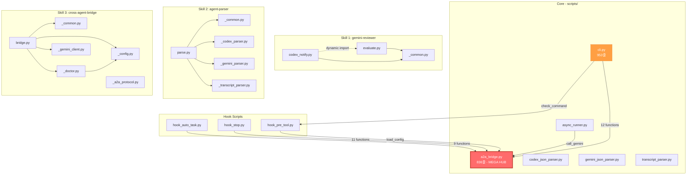
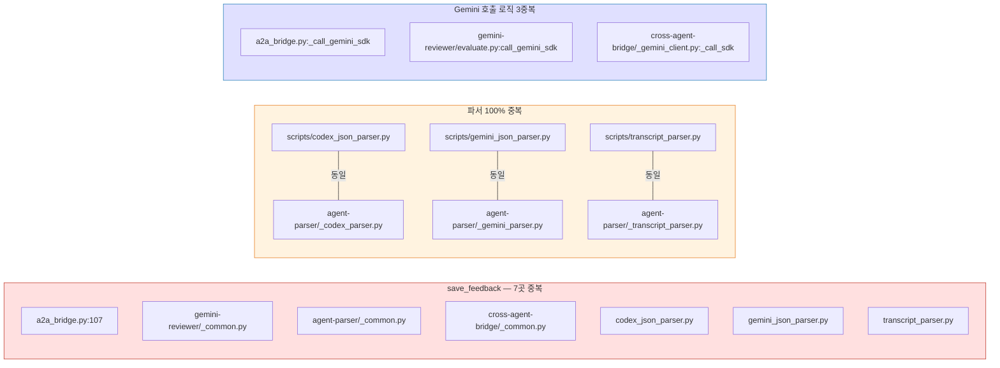
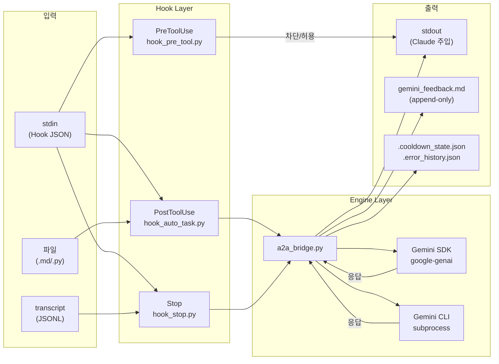
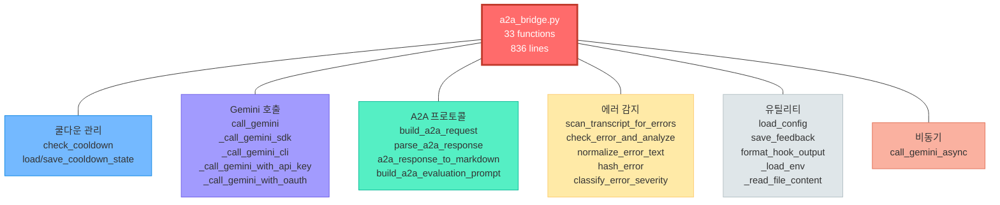

# 아키텍처 분석 — 의존성 맵 + 주요 Hub 식별

> 생성: CTO(Claude) | 분석 기반: Gemini(CSO) 코드베이스 분석 + Claude 정밀 검증
> 날짜: 2026-02-16

---

## 1. 모듈 의존성 그래프

### Hub 랭킹

| 순위 | 모듈 | 의존자 수 | 줄 수 | 역할 |
|---|---|---|---|---|
| **1** | `a2a_bridge.py` | **5개** (3 hooks + cli + async_runner) | 836 | Gemini SDK/CLI, 쿨다운, A2A, 에러감지 — 모든 것 |
| **2** | `cli.py` | 0 (최종 소비자) | 953 | doctor, status, test 등 관리 도구 |
| **3** | `_config.py` (bridge) | 2개 (bridge, _doctor) | 116 | 설정 로딩/검증 |

---

## 2. 코드 중복 분석

### 중복 상세

| 중복 항목 | 발생 횟수 | 심각도 |
|---|---|---|
| `save_feedback()` | **7곳** | Critical |
| 파서 코드 (codex/gemini/claude) | **2벌** (scripts/ vs skills/) | High |
| Gemini SDK 호출 로직 | **3곳** | High |
| `read_input()` / `load_env()` | **4곳** | Medium |
| `load_config()` | **2곳** (a2a_bridge vs _config.py) | Medium |

---

## 3. 데이터 흐름도

---

## 4. 핵심 문제점 (CTO 진단)

### Problem 1: God Object — `a2a_bridge.py`
- **836줄에 33개 함수** — 단일 책임 원칙 위반
- 쿨다운, 에러 감지, A2A 프로토콜, Gemini 호출, OAuth, 피드백 저장 — 모두 한 파일
- **5개 파일이 의존** → 변경 시 영향 범위 최대

### Problem 2: 이중 구조 (scripts/ vs skills/)
- Phase 6에서 skills/를 만들었지만 **scripts/를 정리하지 않음**
- hooks가 여전히 `a2a_bridge.py`에 의존 → skills/ 코드와 단절
- **결과**: 동일 로직이 2~3곳에 존재, 어디가 정본인지 불명확

### Problem 3: 역할 경계 불명확
- `cli.py`가 953줄 — doctor/status/stats/search/test/clear/codex 모든 것
- `bridge.py`도 doctor/parse 기능 보유 → cli.py와 기능 중복
- Hook scripts는 진입점인데 로직도 포함

### Problem 4: 설정 분산
- `config.json` → `a2a_bridge.load_config()` + `_config.py.load_config()` 2곳에서 로딩
- 환경변수 로딩도 `_load_env()` / `load_env()` 이름만 다르고 동일

---

## 5. 주요 Hub 시각화

이것이 분해(decompose)해야 할 6개 도메인입니다.
