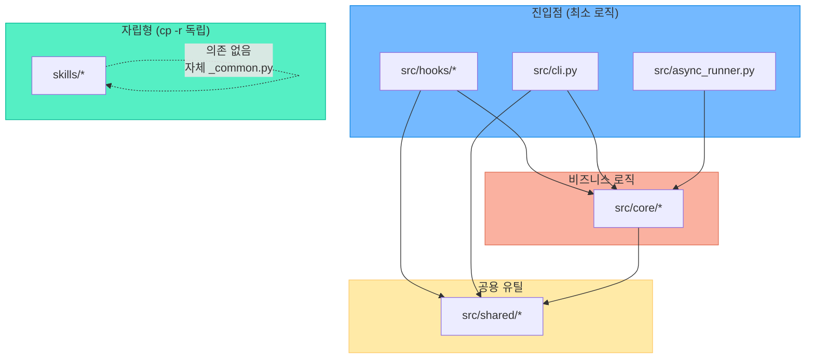

# CTO 최종 아키텍처 — CSO 전략 검증 + 세부 보완

> 작성: CTO(Claude) | CSO(Gemini) 전략 검증 후 확정 | CEO 리뷰 반영
> 날짜: 2026-02-16 (rev.1: CEO 수정사항 반영)

---

## CSO 전략 검토 결과

### 동의하는 부분
- a2a_bridge.py God Object 분해 → 6개 도메인 분리 (정확한 진단)
- scripts/ 중복 파서 삭제 (즉시 실행 가능)
- 마이그레이션 5단계 순서 (위험도 판단 적절)

### CSO가 놓친 세부사항 (CTO 보완)

1. **자립성 원칙과 `src/core/` 충돌**
   - CSO는 skills/가 `src/core/`를 import하도록 제안 → **자립성 원칙 위반**
   - skills/는 `cp -r`로 독립 설치 가능해야 함 → core/ 의존 불가
   - **해결**: skills/의 `_common.py`는 유지 (55줄 복사 허용), `src/core/`는 hooks/cli만 사용

2. **Hook 경로 문제**
   - `.claude/settings.local.json`의 hook 경로가 `scripts/hook_*.py`로 등록됨
   - `src/hooks/`로 이동하면 **모든 hook 등록 경로 변경 필요**
   - **해결**: hooks는 `src/hooks/`로 이동 + settings.local.json 동시 업데이트

3. **config.json 위치**
   - CSO가 config.json 위치를 명시하지 않음
   - 현재 `scripts/config.json` → `src/core/`가 참조해야 함
   - **해결**: 프로젝트 루트로 이동 (`config.json`)

4. **fcntl 파일 락**
   - `save_feedback()`의 fcntl 락은 `shared/feedback_manager.py`로 이동 시 정확히 보존해야 함
   - skills/ 내 `_common.py`도 동일한 fcntl 패턴 유지

---

## 최종 디렉토리 구조 (확정)

```
claude-gemini-communicator/
├── config.json                  ← 루트로 이동 (단일 설정 파일)
├── .env                         ← API keys (gitignore)
├── .claude/
│   └── settings.local.json      ← Hook 경로 업데이트 필요
│
├── src/                         ← 핵심 런타임 코드
│   ├── core/                    ← 비즈니스 로직 (hooks/cli 전용)
│   │   ├── __init__.py
│   │   ├── cooldown.py          ← 쿨다운 관리
│   │   ├── gemini_service.py    ← Gemini SDK/CLI 호출
│   │   ├── a2a_protocol.py      ← A2A 메시지 빌드/파싱
│   │   └── error_analyzer.py    ← 에러 감지/분석
│   │
│   ├── shared/                  ← 공용 유틸리티
│   │   ├── __init__.py
│   │   ├── config.py            ← load_config, load_env, validate_config
│   │   ├── feedback.py          ← save_feedback (fcntl lock, 단일 정본)
│   │   └── hook_io.py           ← format_hook_output, read_file_content
│   │
│   ├── hooks/                   ← Hook 진입점 (최소 로직)
│   │   ├── hook_auto_task.py    ← PostToolUse → core/gemini_service
│   │   ├── hook_stop.py         ← Stop → core/error_analyzer
│   │   └── hook_pre_tool.py     ← PreToolUse → 패턴 매칭 (독립)
│   │
│   ├── cli.py                   ← CLI 진입점 (500줄 이하)
│   └── async_runner.py          ← 비동기 Gemini 호출 실행기
│
├── skills/                      ← 자립형 스킬 (cp -r 독립 설치)
│   ├── gemini-reviewer/         ← Gemini 리뷰 스킬
│   │   ├── SKILL.md
│   │   ├── scripts/
│   │   │   ├── _common.py       ← 자체 유틸 (55줄, 복사본)
│   │   │   ├── evaluate.py      ← 자체 Gemini 호출 (독립)
│   │   │   └── codex_notify.py
│   │   └── references/
│   │
│   ├── agent-parser/            ← 파서 스킬 (정본)
│   │   ├── SKILL.md
│   │   ├── scripts/
│   │   │   ├── _common.py
│   │   │   ├── parse.py
│   │   │   ├── _codex_parser.py
│   │   │   ├── _gemini_parser.py
│   │   │   └── _transcript_parser.py
│   │   └── references/
│   │
│   └── cross-agent-bridge/      ← 통합 오케스트레이터 스킬
│       ├── SKILL.md
│       ├── scripts/
│       │   ├── _common.py       ← 자체 유틸 (복사본)
│       │   ├── _config.py       ← 자체 config 로딩 (독립)
│       │   ├── _gemini_client.py ← 자체 Gemini 호출 (독립)
│       │   ├── _a2a_protocol.py
│       │   ├── _doctor.py
│       │   └── bridge.py
│       └── references/
│
├── architecture/                ← 아키텍처 분석 문서 (이 디렉토리)
│   ├── _codebase_snapshot.md
│   ├── 01_dependency_analysis.md
│   ├── 02_cso_strategy.md
│   └── 03_cto_final_architecture.md  ← 이 파일
│
├── plans/                       ← 설계 문서
├── schemas/                     ← JSON 스키마
└── [CLAUDE.md, README.md, etc.]
```

---

## 의존성 규칙 (확정)



### 핵심 규칙
1. **src/hooks/** → `src/core/` + `src/shared/`만 import (직접 Gemini 호출 금지)
2. **src/core/** → `src/shared/`만 import (hooks/skills 의존 금지)
3. **src/shared/** → 외부 의존 없음 (stdlib + pathlib만)
4. **skills/** → **외부 import 금지** (자체 `_common.py` 사용)

---

## 삭제 대상 파일 목록

| 파일 | 이유 | 마이그레이션 단계 |
|---|---|---|
| `scripts/a2a_bridge.py` | `src/core/` 4개 모듈로 분해 → 호환 프록시로 단계 축소 | 단계 2에서 분해, 단계 5에서 호환 레이어 유지 또는 삭제 |
| `scripts/codex_json_parser.py` | `skills/agent-parser/` 정본 존재 | 단계 3 |
| `scripts/gemini_json_parser.py` | `skills/agent-parser/` 정본 존재 | 단계 3 |
| `scripts/transcript_parser.py` | `skills/agent-parser/` 정본 존재 | 단계 3 |
| `scripts/hook_auto_task.py` | `src/hooks/`로 이동 | 단계 4 |
| `scripts/hook_stop.py` | `src/hooks/`로 이동 | 단계 4 |
| `scripts/hook_pre_tool.py` | `src/hooks/`로 이동 | 단계 4 |
| `scripts/cli.py` | `src/cli.py`로 이동 + 간소화 | 단계 4 |
| `scripts/async_runner.py` | `src/async_runner.py`로 이동 | 단계 4 |
| `scripts/config.json` | 루트 `config.json`으로 이동 | 단계 1 |
| `scripts/setup.sh` | `requirements.txt` + README로 대체 | 단계 5 |

---

## 마이그레이션 실행 계획 (CTO 확정)

### 단계 1: Foundation — shared/ 생성 + config 이동
```
[Codex] config.json 루트 이동 + src/shared/ 3파일 작성
[Claude] 코드 리뷰 + 기존 경로 참조 확인
```
- `src/shared/config.py` ← a2a_bridge.py의 load_config + _load_env
- `src/shared/feedback.py` ← a2a_bridge.py의 save_feedback (fcntl)
- `src/shared/hook_io.py` ← a2a_bridge.py의 format_hook_output
- `config.json` → 프로젝트 루트로 이동

### 단계 2: Core — a2a_bridge.py 분해
```
[Codex] src/core/ 4파일 작성 (테스트 코드 먼저)
[Claude] 함수별 시그니처 검증 + 코드 리뷰
[Gemini] 분해 구조 비판
```
- `src/core/cooldown.py` ← check_cooldown, load/save_cooldown_state
- `src/core/gemini_service.py` ← call_gemini, _call_gemini_sdk/cli, call_gemini_async
- `src/core/a2a_protocol.py` ← build_a2a_request, parse_a2a_response, etc.
- `src/core/error_analyzer.py` ← scan_transcript_for_errors, check_error_and_analyze

### 단계 3: Cleanup — 중복 파서 삭제
```
[Claude] scripts/ 파서 3종 삭제
```

### 단계 4: Migration — hooks/cli 이동 + 의존성 업데이트
```
[Codex] hooks 3파일 + cli.py + async_runner.py를 src/로 이동 + import 변경
[Claude] .claude/settings.local.json hook 경로 업데이트 + 코드 리뷰
```

### 단계 5: Final — scripts/ 호환 레이어 정리
```
[Claude] scripts/에서 src/로 이동 완료된 파일 정리
        scripts/는 호환 프록시로 잔존 가능 (CEO 방침: 완전 소멸은 후순위)
        CLAUDE.md 업데이트 + 커밋
```

---

## Mermaid: 최종 호출 흐름

```mermaid
flowchart LR
    subgraph INPUT["입력"]
        STDIN["stdin\n(Hook JSON)"]
        FILE["파일"]
    end

    subgraph HOOKS["src/hooks/"]
        H1["hook_auto_task"]
        H2["hook_stop"]
        H3["hook_pre_tool"]
    end

    subgraph CORE["src/core/"]
        GS["gemini_service"]
        CD["cooldown"]
        A2A["a2a_protocol"]
        EA["error_analyzer"]
    end

    subgraph SHARED["src/shared/"]
        CFG["config"]
        FB["feedback"]
        HIO["hook_io"]
    end

    subgraph EXTERNAL["External"]
        SDK["Gemini SDK"]
        CLI_G["Gemini CLI"]
    end

    subgraph OUTPUT["출력"]
        STDOUT["stdout → Claude"]
        FBMD["gemini_feedback.md"]
    end

    STDIN --> H1 & H2 & H3
    FILE --> H1

    H1 --> CD --> CFG
    H1 --> GS --> SDK & CLI_G
    H1 --> A2A
    H1 --> HIO

    H2 --> EA --> GS
    H2 --> A2A

    H3 -->|"패턴 매칭"| STDOUT

    GS --> FB --> FBMD
    HIO --> STDOUT
