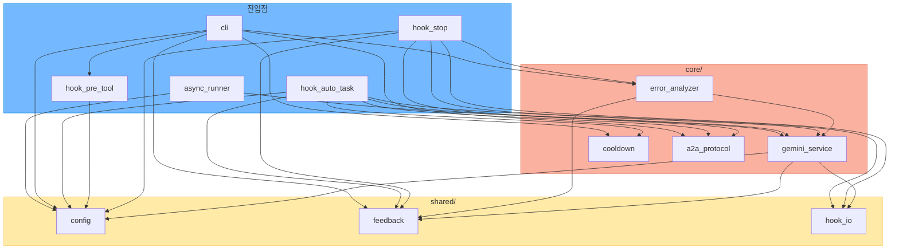
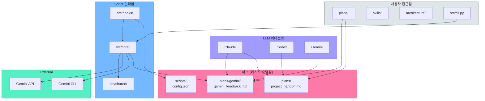

# 04 — 새 아키텍처 의존성 분석 (마이그레이션 후)

> 작성: CTO(Claude) | 도구: depsolve-analyzer + graph-structure-classifier
> 날짜: 2026-02-16 (rev.3: 갭 해소 완료 후 최종 검증)

---

## 1. src/ 내부 그래프 분류

**구조: DAG (순환 없음)**

| 지표 | 값 |
|---|---|
| 노드 | 12 |
| 엣지 | 26 |
| 최대 in-degree | 6 (`shared.config`) |
| 순환 | **없음** |
| 구조 유형 | DAG |

### 허브 랭킹 (in-degree 순)

| 순위 | 모듈 | in-degree | 역할 | 줄 수 |
|---|---|---|---|---|
| 1 | `shared.config` | 6 | 설정 로더 | ~85 |
| 2 | `shared.feedback` | 4 | 피드백 저장 | ~30 |
| 3 | `core.gemini_service` | 4 | Gemini 호출 | ~230 |
| 4 | `shared.hook_io` | 3 | Hook I/O | ~35 |
| 5 | `core.a2a_protocol` | 3 | A2A 메시지 | ~150 |
| 6 | `core.cooldown` | 2 | 쿨다운 | ~50 |
| 7 | `core.error_analyzer` | 2 | 에러 감지 | ~170 |

**이전 vs 현재:**
- 이전 1위: `a2a_bridge.py` (5 dependents, **836줄**, God Object)
- 현재 1위: `shared.config` (6 dependents, **85줄**, 변경 거의 없음)
- 허브가 작고 안정적인 모듈로 이동 → 건전한 DAG

### 레이어 규칙 준수 확인

```
hooks/ → core/ → shared/   (정방향만 ✓)
hooks/ → shared/            (건너뛰기 허용 ✓)
core/ → shared/             (정방향만 ✓)
shared/ → (외부 없음)       (독립 ✓)
```

**위반 없음.**

### Mermaid: src/ 의존성 그래프



---

## 2. Phantom 의존성 (depsolve-analyzer)

| 패키지 | 심각도 | 사용 위치 | 조치 |
|---|---|---|---|
| `httpx` | ~~HIGH~~ **해소** | `gemini_service.py` (OAuth REST 호출) | ✅ requirements.txt에 추가 완료 |

~~현재 requirements.txt: `google-genai`, `google-auth` 2개만 선언.~~
requirements.txt: `google-genai`, `google-auth`, `httpx` 3개 선언 (rev.3 반영).

---

## 3. 전체 프로젝트 3관점 허브 분석

### 구조: DAG (순환 없음, 26노드, 31엣지)

### 관점 A: Script 레이어 (런타임 실행 흐름)

```
Claude Code ──→ src/hooks/ ──→ src/core/ ──→ Gemini API/CLI
                                  │
                                  ▼
                         plans/gemini/gemini_feedback.md
                                  ▲
Codex CLI ──→ skills/gemini-reviewer/codex_notify ─┘
```

### 관점 B: LLM 레이어 (에이전트 간 메시지 교환)

```
Claude ←→ plans/claude/             (자기 문서)
Claude  → plans/gemini/feedback     (Gemini 피드백 읽기)
Claude ←→ plans/project_handoff     (핸드오프)
Claude ←  CLAUDE.md                 (지침)

Codex  ←→ plans/codex/             (자기 문서)
Codex  ←  AGENTS.md                (지침)
Codex  ←→ plans/project_handoff    (핸드오프)

Gemini  → plans/gemini/feedback    (피드백 쓰기)
Gemini ←  .gemini/review.md        (리뷰 규칙)
```

### 관점 C: User 레이어 (사용자 접근점)

```
User ──→ plans/                     (전체 계획 열람 — 핵심 허브)
User ──→ skills/                    (스킬 관리/설치)
User ──→ architecture/              (아키텍처 문서)
User ──→ src/cli.py                 (CLI 도구)
User ──→ plans/gemini/feedback      (Gemini 결과 확인)
```

### 멀티-에이전트 허브 (Multi-parent 노드)

| 허브 | 접근 주체 | in-degree | 역할 |
|---|---|---|---|
| **`plans/gemini/gemini_feedback.md`** | Claude(read), Codex-notify(write), User(read), Gemini-service(write) | **6** | **메시지 버스 핵심** — 모든 에이전트의 피드백 수렴점 |
| **`plans/project_handoff.md`** | Claude, Codex, User | 3 | 에이전트 간 컨텍스트 전달 문서 |
| **`plans/`** (디렉토리) | User, Claude, Codex | 3 | **사용자-에이전트 공유 허브** |
| **`scripts/config.json`** | 3개 Hook, CLI | 4 | 런타임 설정 허브 |
| **`src.core.gemini_service`** | hooks, error_analyzer, async_runner | 4 | Gemini 호출 단일 경로 |

### Mermaid: 3관점 통합



---

## 4. 핵심 발견: plans/가 메시지 버스다

```
plans/
├── claude/          ← Claude 전용 작업 공간
├── codex/           ← Codex 전용 작업 공간
├── gemini/
│   └── gemini_feedback.md  ← 전 에이전트 피드백 수렴점
└── project_handoff.md      ← 에이전트 간 컨텍스트 전달
```

**plans/ 디렉토리가 de facto 메시지 버스 역할:**
- 각 에이전트별 서브디렉토리 (`claude/`, `codex/`, `gemini/`)
- 사용자도 직접 열람/수정
- `gemini_feedback.md`가 가장 높은 in-degree (6)
- `project_handoff.md`가 에이전트 간 컨텍스트 채널

**src/는 이 버스의 배달원:**
- hooks → core → `plans/gemini/gemini_feedback.md`에 쓰기
- 사용자/에이전트는 plans/를 통해 결과를 읽음

---

## 5. 001 Framework 체크리스트 교차 검증

| Critical 항목 | 현재 상태 | Gap | 해소 |
|---|---|---|---|
| 상위 목적 = 메시지 버스 | **충족** — plans/가 de facto 버스 | ~~공통 필드 미강제~~ | ✅ 8필드 구현 |
| 공통 최소 8필드 | ~~A2A에 5/8 존재~~ **8/8 완료** | ~~`message_id`, `target_agent`, `status` 누락~~ | ✅ `build_a2a_request()` |
| 추적 가능성 | ~~`request_id` 미연결~~ **전 경로 연결** | ~~feedback.md와 미연결~~ | ✅ `save_feedback(request_id=)` |
| 실패 상태 구조화 | ~~문자열~~ **구조화 완료** | ~~구조화된 status 필요~~ | ✅ `parse_error_status()` |

### 해소 완료 요약 (rev.3)

| # | 갭 | 구현 | 커밋 |
|---|---|---|---|
| 1 | A2A 8필드 엔벨로프 | `src/core/a2a_protocol.py:build_a2a_request()` — message_id, target_agent, status 추가 | `d17a8ce` |
| 2 | request_id 추적 | `src/shared/feedback.py:save_feedback(request_id=)` — 전 Hook에서 UUID 생성/전파 | `d17a8ce` |
| 3 | 에러 구조화 | `src/core/a2a_protocol.py:parse_error_status()` — [SDK_ERROR]/[ERROR]/[FALLBACK] → dict | `d17a8ce` |
| 4 | httpx 미선언 | `requirements.txt` — httpx>=0.24.0 추가 | `af234e1` |

### 테스트 검증

- 47건 전체 통과 (`tests/test_shared.py`, `test_core.py`, `test_hooks.py`)
- A2A 8필드 엔벨로프, parse_error_status, request_id 전파 모두 테스트 커버

### 다음 단계 (Phase 2-3)

1. **JSONL 버스 도입** (001 §6 Phase 3): `plans/gemini/a2a_events.jsonl` 병행 기록
2. **parent_message_id** (001 §7 선택 확장): 멀티홉 체인 추적
3. **scripts/ 정리**: 레거시 `scripts/a2a_bridge.py` 호환 레이어 제거 또는 유지 결정
