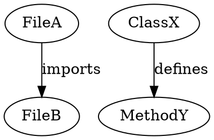

# Codebase Graph Analysis & Visualization Tools Knowledge Base
- ver: `v0.2.0`
- generated_at: `2026-03-20`
- updated_at: `2026-03-21` (v0.2.0: hybrid_kb 성격 명시, 경계 문장 추가)
- kb_type: `hybrid_kb` — 분석/시각화 도구 조사 자산 + Neo4j 적재 파이프라인 + Canonical Design Takeaways
- format: `- [한 줄 설명](URL)`
- generation_method: `공식 문서 + 실무 사례 조사`
- total_urls: `4`
- paper_like_urls: `0`
- other_urls: `4`

## Scope Boundary

이 KB는 **코드베이스 그래프 분석/시각화 플랫폼(Neo4j, Cytoscape, Gephi)과 DOT→Neo4j 적재 파이프라인**을 다룬다.
DOT ↔ Mermaid 포맷 변환 도구 자체는 `graphviz-mermaid-conversion-tools-kb.md`가 담당한다.
두 KB 모두 mermaid-authoring-strategy의 conversion/tooling 축 KB이며, core canonical KB는 `mermaid-safe-authoring-kb.md`이다.

## Document Map

| 문서 | 역할 |
|------|------|
| `knowledge_bases/mermaid-safe-authoring-kb.md` | parser-safe 작성 규칙 canonical KB (**core source of truth**) |
| `knowledge_bases/graphviz-mermaid-conversion-tools-kb.md` | conversion/tooling strategy — DOT ↔ Mermaid 도구 조사 (hybrid KB) |
| `knowledge_bases/codebase-graph-analysis-tools-kb.md` (이 파일) | visualization ecosystem — Neo4j/Cytoscape/Gephi (hybrid KB) |

## Table of Contents
- [분석/시각화 플랫폼](#분석시각화-플랫폼)
- [Graphviz → Neo4j 파이프라인](#graphviz--neo4j-파이프라인)
- [Canonical Design Takeaways](#canonical-design-takeaways)

## 분석/시각화 플랫폼

- [Cytoscape.js — JS 기반 그래프 분석·시각화 라이브러리, 웹 UI 인터랙티브 렌더링](https://js.cytoscape.org)
  - sources: `공식 문서`
  - agent: `Claude Code`
  - taxonomy: [[visualization]] [[web]] · JS Library
  - key_idea: 브라우저 내에서 그래프를 인터랙티브하게 렌더링하고 레이아웃/필터/스타일링을 프로그래밍 가능하게 제공.
  - execution_conditions: Node.js 또는 브라우저, `npm install cytoscape`
  - pseudocode_3lines:
    - 1) JSON 형태의 노드/엣지 데이터를 Cytoscape 인스턴스에 로드한다.
    - 2) 레이아웃 알고리즘 (cose, dagre, elk 등)을 적용한다.
    - 3) 웹 UI에서 줌/패닝/선택/필터 인터랙션을 제공한다.
  - best_for: 웹 앱 내 프론트엔드 그래프 시각화. `statelyai/graph`에서 Cytoscape JSON 직접 export 가능.

- [Gephi — 대규모 네트워크 탐색·조작 데스크탑 플랫폼](https://gephi.org)
  - sources: `공식 사이트`
  - agent: `Claude Code`
  - taxonomy: [[visualization]] [[desktop]] · Desktop App
  - key_idea: 수만~수십만 노드 규모의 그래프를 GUI에서 레이아웃/군집/통계 분석.
  - execution_conditions: Java 런타임, Gephi 설치, GEXF/GraphML/CSV import
  - pseudocode_3lines:
    - 1) GEXF 또는 CSV로 그래프 데이터를 import한다.
    - 2) ForceAtlas2 등 레이아웃으로 그래프를 펼친다.
    - 3) 군집/허브/중심성 통계를 실행하고 시각적으로 탐색한다.
  - best_for: 전체 구조를 매크로하게 훑기. 일회성 탐색에 적합. 지속 갱신에는 부적합.

- [Neo4j — 그래프 데이터베이스, Cypher 질의, 코드베이스 지식그래프](https://neo4j.com)
  - sources: `Neo4j 공식 문서, Codebase Knowledge Graph 블로그`
  - agent: `Claude Code`
  - taxonomy: [[graph-db]] [[analysis]] · Database
  - key_idea: 그래프를 저장하고 Cypher로 질의하며, 코드베이스 의존성/호출체인/순환 분석을 반복 실행.
  - execution_conditions: Neo4j Community/Enterprise, `LOAD CSV` 또는 APOC GraphML import
  - pseudocode_3lines:
    - 1) 코드 AST/의존성에서 노드(파일, 클래스, 메서드)와 엣지(imports, defines, calls)를 추출한다.
    - 2) CSV 또는 Cypher MERGE 문으로 Neo4j에 적재한다.
    - 3) Cypher로 의존성 체인, 순환, 중심성 질의를 실행한다.
  - best_for: 코드베이스 분석이 목적이면 1순위. 반복 질의/갱신/자동화에 가장 적합.
  - cross_ref: [Codebase Knowledge Graph — Neo4j Blog](https://neo4j.com/blog/developer/codebase-knowledge-graph/)

## Graphviz → Neo4j 파이프라인

DOT를 Neo4j에 직접 import하는 공식 파이프라인은 없다. 정석은 DOT 파싱 → 중간 포맷 → Neo4j 적재.

- [Neo4j LOAD CSV — CSV 기반 그래프 적재 공식 방법](https://neo4j.com/docs/cypher-manual/current/clauses/load-csv/)
  - sources: `Neo4j Cypher Manual`
  - agent: `Claude Code`
  - taxonomy: [[import]] [[neo4j]] · Import Method
  - key_idea: CSV 파일에서 노드와 관계를 읽어 MERGE/CREATE로 그래프를 구축하는 Neo4j 표준 적재 방식.

### 변환 절차

```
DOT 파일
  ↓ pydot / gographviz 등으로 파싱
노드/엣지 추출
  ↓
nodes.csv + rels.csv 생성
  ↓
Neo4j LOAD CSV 또는 APOC import
```

#### 예시: DOT → CSV

DOT 입력:


nodes.csv:
```csv
id,label
FileA,File
FileB,File
ClassX,Class
MethodY,Method
```

rels.csv:
```csv
src,rel,dst
FileA,IMPORTS,FileB
ClassX,DEFINES,MethodY
```

Cypher 적재:
```cypher
LOAD CSV WITH HEADERS FROM 'file:///nodes.csv' AS row
MERGE (n:Entity {id: row.id})
SET n.label = row.label;

LOAD CSV WITH HEADERS FROM 'file:///rels.csv' AS row
MATCH (a:Entity {id: row.src})
MATCH (b:Entity {id: row.dst})
MERGE (a)-[:REL {type: row.rel}]->(b);
```

## Canonical Design Takeaways

### T-A1: 코드베이스 분석 = Neo4j 중심

코드베이스는 "그림"이 아니라 "질의"가 핵심. 어떤 모듈이 가장 의존되는가, 호출 체인이 몇 단계인가, 순환 의존성은 어디인가 — 이런 질문은 Graphviz/Mermaid보다 그래프 DB 질의가 적합하다.

### T-A2: 역할 분리

| 역할 | 추천 도구 |
|------|-----------|
| 저장 + 반복 질의 + 자동화 | **Neo4j** |
| 웹 프론트 인터랙티브 시각화 | **Cytoscape.js** |
| 정적 도식 (발표, 문서) | **Graphviz** 또는 **Mermaid** |
| 일회성 대규모 탐색 | **Gephi** |

### T-A3: Graphviz → Neo4j는 DOT 파싱 → CSV가 정석

직접 import 경로가 없으므로, `pydot` 등으로 DOT를 파싱하고 CSV로 변환한 뒤 `LOAD CSV`로 적재한다. 이 중간 CSV는 Gephi, Cytoscape, Mermaid로도 재사용 가능.

### T-A4: 추천 조합 (코드베이스 분석용)

- **빠른 시작**: AST/의존성 추출 → edge list/CSV → Graphviz
- **복잡해지면**: AST/의존성 추출 → Neo4j
- **프론트 필요하면**: Neo4j 저장 + Cytoscape.js 시각화
- **전체 구조 훑기**: Neo4j 또는 CSV export → Gephi

### T-A5: mermaid-authoring-strategy과의 관계

Mermaid는 **정적 도식** 역할. 코드베이스 분석 결과를 문서/발표에 넣을 때 사용.
분석 자체는 Neo4j/Cytoscape에서 하고, 결과 스냅샷을 Mermaid로 내보내는 흐름이 자연스럽다.
이때도 `mermaid-authoring-strategy` 워크플로우(인접리스트 → 최소 graph TD → 점진 확장)를 따른다.
