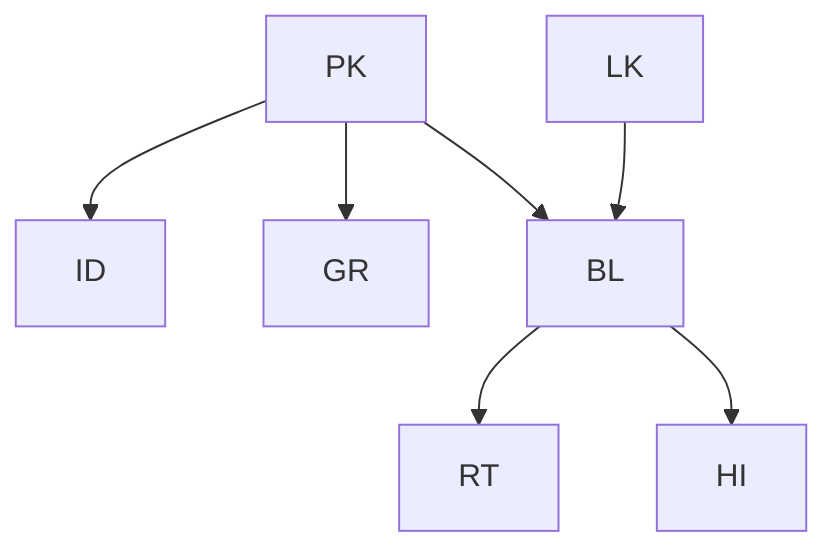
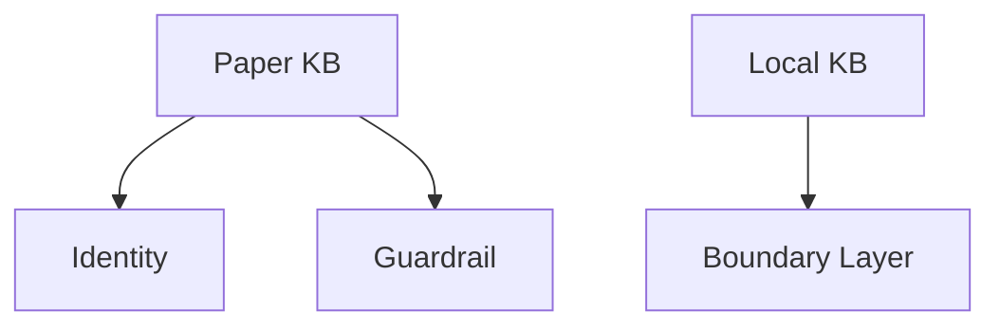
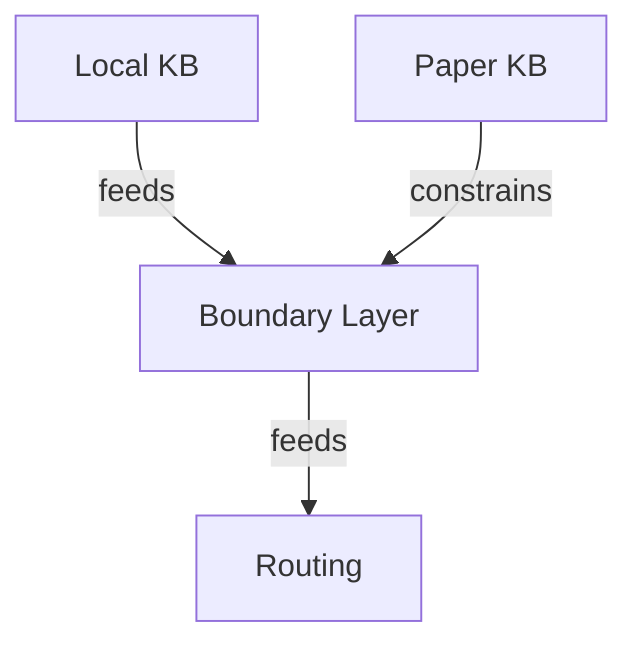
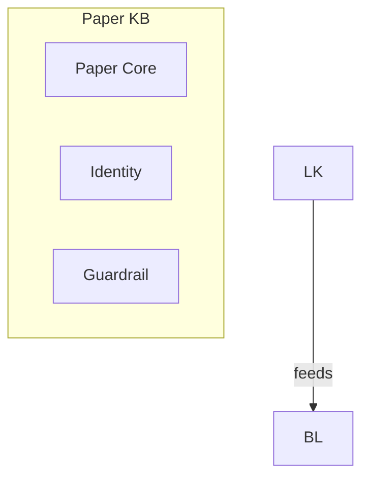

# Mermaid Authoring Workflow

점진적 Mermaid 다이어그램 작성 절차. 한 번에 복잡한 다이어그램을 쓰지 않는다.

## Step 1: 인접리스트 작성

Mermaid 구문을 쓰기 전에 plain text로 관계를 정리한다.

```
contains:
  Paper KB -> Identity
  Paper KB -> Guardrail

feeds:
  Local KB -> Boundary Layer
  Boundary Layer -> Routing

constrains:
  Paper KB -> Boundary Layer

escalates_to:
  Boundary Layer -> HITL Review
```

이점:
- 엣지 타입을 먼저 분류할 수 있다
- 노드 목록이 자연스럽게 나온다
- Mermaid 구문 제약 없이 관계를 자유롭게 표현할 수 있다

## Step 2: 최소 graph TD

인접리스트의 모든 엣지를 `-->` 만으로 변환한다. 라벨, 스타일, subgraph 없음.



이 단계에서 렌더가 성공해야 다음으로 넘어간다.

## Step 3: 노드 라벨 추가

짧은 라벨을 `[]` 안에 추가한다. 특수문자와 긴 설명은 피한다.



## Step 4: 엣지 라벨 추가

한 카테고리씩 추가한다. 예: 먼저 `feeds`만, 다음에 `constrains`만.



## Step 5: subgraph 변환

인접리스트의 `contains` 관계를 subgraph membership으로 변환한다.



## Step 6: 스타일 추가

구조가 확정된 후에만 스타일을 추가한다.

```
classDef kbNode fill:#fff8e8,stroke:#8f6b3d;
linkStyle 0,1,2 stroke:#1f6f5f,stroke-width:3px;
```

주의: `linkStyle` 인덱스는 엣지 선언 순서에 의존한다. 엣지를 추가/삭제하면 재계산 필요.

## Anti-patterns

| 잘못된 접근 | 올바른 접근 |
|---|---|
| 처음부터 classDef + 라벨 + subgraph 동시 작성 | 최소 `-->` 먼저 → 점진 추가 |
| 렌더 실패 시 스타일을 수정 | 스타일 제거 → 구문 먼저 확인 |
| 긴 한국어 라벨로 시작 | 짧은 영문 약어 → 나중에 라벨 확장 |
| 인접리스트 없이 바로 Mermaid 작성 | plain text로 관계 정리 먼저 |
