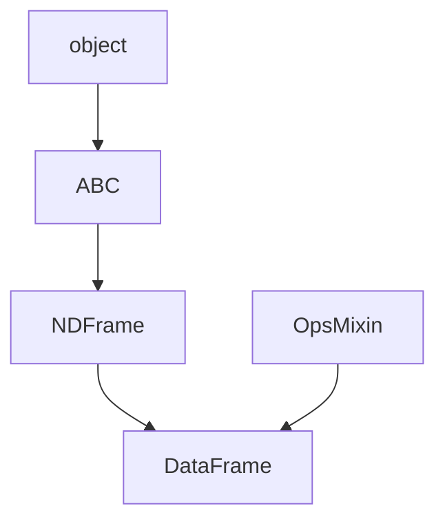

# Bridge: class-hierarchy-classifier → graph-structure-classifier

`class-hierarchy-classifier`의 상속 관계를 `graph-structure-classifier`로 전달하여 상세한 구조 분석을 수행합니다.

## When to Use

**간단한 분류**: `--classify-structure` 옵션으로 내장 분류기 사용

**상세 분석이 필요할 때**: 
- 순환 탐지 상세 정보
- GraphML 출력 (LLM context)
- Mermaid 시각화
- 위상 정렬

## Quick Start

```bash
# Edge 추출 후 classifier로 파이프
python scripts/hierarchy_classifier.py pandas.DataFrame --output-edges | \
    python $SKILLS_ROOT/graph-structure-classifier/scripts/classifier.py -

# Mermaid 출력
python scripts/hierarchy_classifier.py pandas.DataFrame --output-edges | \
    python $SKILLS_ROOT/graph-structure-classifier/scripts/classifier.py - --format mermaid

# GraphML 출력 (LLM context용)
python scripts/hierarchy_classifier.py pandas.DataFrame --output-edges | \
    python $SKILLS_ROOT/graph-structure-classifier/scripts/classifier.py - --format graphml
```

## Workflow

```
┌─────────────────────────────────┐
│  class-hierarchy-classifier     │
│  --output-edges                 │
└─────────────────────────────────┘
              │
              │ [["parent", "child"], ...]
              ▼
┌─────────────────────────────────┐
│  graph-structure-classifier     │
│  - Cycle detection              │
│  - In-degree analysis           │
│  - Connectivity check           │
│  - Structure classification     │
└─────────────────────────────────┘
              │
              ▼
        ┌─────┴─────┐
        │           │
        ▼           ▼
    [JSON]      [Mermaid/GraphML]
    상세 분석     시각화/LLM context
```

## Edge Format

`--output-edges` 출력:

```json
[
  ["object", "ABC"],
  ["ABC", "NDFrame"],
  ["NDFrame", "DataFrame"],
  ["OpsMixin", "DataFrame"]
]
```

`graph-structure-classifier` 입력과 호환됩니다.

## Python API

```python
from scripts.hierarchy_classifier import analyze_hierarchy, extract_inheritance_edges

# Step 1: 컴포넌트 로드 및 edge 추출
specs = {"DataFrame": "pandas.DataFrame"}
components = analyze_hierarchy(specs)
edges = extract_inheritance_edges(components)

# Step 2: graph-structure-classifier로 분류
import sys
sys.path.insert(0, '$SKILLS_ROOT/graph-structure-classifier/scripts')
from classifier import classify_graph

result = classify_graph(edges)
print(result.structure_type)  # DAG
print(result.multi_parent_nodes)  # ['DataFrame']
```

## Output Examples

### JSON (상세 분석)

```json
{
  "structure_type": "DAG",
  "reason": "Multi-parent nodes: ['DataFrame']",
  "stats": {
    "nodes": 8,
    "edges": 7,
    "max_in_degree": 2,
    "has_cycle": false
  },
  "details": {
    "multi_parent_nodes": ["DataFrame"],
    "root_nodes": ["object"],
    "cycle_nodes": []
  }
}
```

### Mermaid (시각화)



### GraphML (LLM context)

```xml
<graphml>
  <node id="DataFrame" layer="3" position="0"/>
  <node id="NDFrame" layer="2" position="0"/>
  <edge source="NDFrame" target="DataFrame" layer_diff="1"/>
</graphml>
```

## Structure Types

| Type | 의미 | 상속 구조 |
|------|------|-----------|
| Tree | 단일 부모, 단일 루트 | 단일 상속 |
| DAG | 다중 부모 허용 | 다중 상속 (일반적) |
| MultiEdgeDAG | 중복 엣지 존재 | 드묾 |
| DirectedGraph | 순환 존재 | 오류 가능성 |

## Notes

- 대부분의 Python 클래스 상속은 Tree 또는 DAG
- Diamond inheritance (다이아몬드 상속)는 DAG로 분류됨
- 순환 상속은 Python에서 허용되지 않으므로 DirectedGraph는 거의 발생하지 않음
