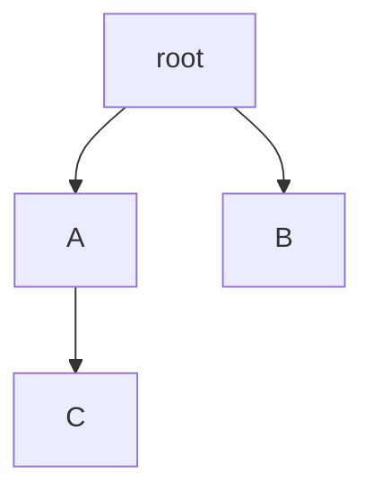
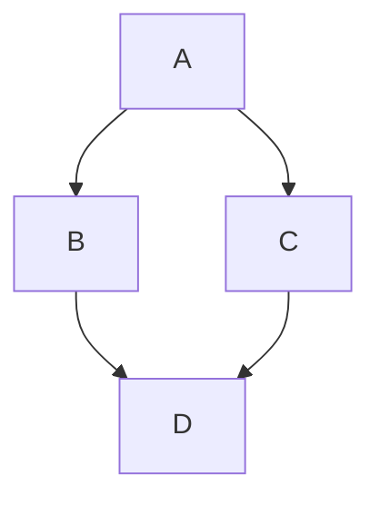
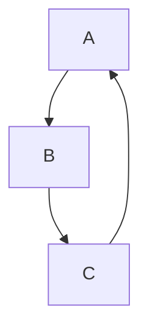

# Examples

## Tree

```python
edges = [("root", "A"), ("root", "B"), ("A", "C")]
# → Tree (single root, single parent, connected)
```



## DAG (Diamond)

```python
edges = [("A", "B"), ("A", "C"), ("B", "D"), ("C", "D")]
# → DAG (D has 2 parents)
```



## DAG (Forest)

```python
edges = [("A", "B"), ("C", "D")]
# → DAG (2 roots, disconnected)
```

## MultiEdgeDAG

```python
edges = [("A", "B"), ("A", "B"), ("B", "C")]
# → MultiEdgeDAG (duplicate A→B)
```

## DirectedGraph (Cycle)

```python
edges = [("A", "B"), ("B", "C"), ("C", "A")]
# → DirectedGraph (cycle: A→B→C→A)
```



## Real-World: Build System

```python
edges = [
    ("src", "compile"),
    ("compile", "link"),
    ("lib", "link"),
    ("link", "binary"),
]
# → DAG (link has 2 parents)
```

## Real-World: Import Graph

```python
edges = [
    ("main.py", "utils.py"),
    ("utils.py", "config.py"),
    ("main.py", "config.py"),
]
# → DAG (config.py has 2 parents)
```

## GraphML Output Example

```json
{
  "meta": {"structure_type": "DAG", "node_count": 4},
  "nodes": [
    {"id": "A", "layer": 0, "type": "root"},
    {"id": "D", "layer": 2, "type": "leaf"}
  ],
  "edges": [
    {"source": "A", "target": "B", "layer_diff": 1}
  ]
}
```
