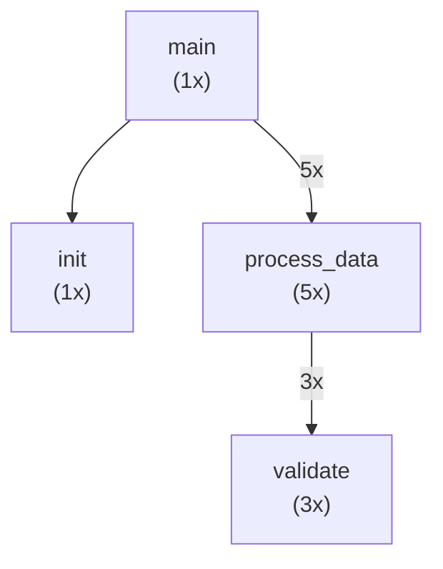

# Output Format Reference

## JSON Output (Default)

상세 분석 결과. LLM context injection에 적합.

```json
{
  "metadata": {
    "entrypoint": "my_script.py",
    "language": "python",
    "traced_at": "2025-01-25T14:30:00",
    "runtime_ms": 1234.56,
    "node_count": 15,
    "edge_count": 20
  },
  "nodes": [
    {
      "id": "main",
      "function": "main",
      "module": "__main__",
      "call_count": 1,
      "first_call_seq": 1
    },
    {
      "id": "utils.process_data",
      "function": "process_data",
      "module": "utils",
      "call_count": 5,
      "first_call_seq": 3
    }
  ],
  "edges": [
    {
      "source": "main",
      "target": "utils.process_data",
      "call_count": 5,
      "first_call_seq": 3
    }
  ],
  "edge_list": [["main", "utils.process_data"]],
  "call_sequence": ["main", "init", "utils.process_data", "validate", "utils.process_data", ...]
}
```

### Fields

| Field | Description |
|-------|-------------|
| `metadata.entrypoint` | 실행한 스크립트 |
| `metadata.runtime_ms` | 실행 시간 (밀리초) |
| `nodes[].call_count` | 해당 함수 호출 횟수 |
| `nodes[].first_call_seq` | 최초 호출 순서 (1-indexed) |
| `edges[].call_count` | 해당 호출 관계 발생 횟수 |
| `call_sequence` | 전체 호출 순서 (시간순) |

---

## Edge List

graph-structure-classifier 입력용.

```json
[["main", "init"], ["main", "process"], ["process", "validate"]]
```

### 사용법
```bash
python tracer.py python script.py --format edge-list | \
    python ../graph-structure-classifier/scripts/classifier.py -
```

---

## Adjacency List

그래프 알고리즘용 텍스트 형식.

```
main: init, process_data, cleanup
process_data: validate, transform, save
validate: check_type, check_range
```

### 해석
- 각 줄: `caller: callee1, callee2, ...`
- `main`이 `init`, `process_data`, `cleanup`을 호출함

---

## Adjacency Matrix

행렬 연산용. 가중치(호출 횟수) 포함.

```
# Nodes: cleanup, init, main, process_data, save, transform, validate
# Matrix (rows=source, cols=target):
       0    1    2    3    4    5    6
  0:   0    0    0    0    0    0    0
  1:   0    0    0    0    0    0    0
  2:   1    1    0    5    0    0    0
  3:   0    0    0    0    1    1    3
  4:   0    0    0    0    0    0    0
  5:   0    0    0    0    0    0    0
  6:   0    0    0    0    0    0    0
```

### 해석
- Row = source (호출자)
- Column = target (피호출자)
- 값 = 호출 횟수
- `matrix[2][3] = 5`: main이 process_data를 5번 호출

---

## Mermaid

시각화용. GitHub, Notion 등에서 렌더링 가능.



### 특징
- 노드 레이블에 호출 횟수 표시
- 엣지에 2회 이상 호출 시 횟수 표시
- 노드 ID는 `.`, `-`를 `_`로 변환

---

## Positional Encoding

레이아웃 좌표와 그래프 중심성 정보 포함.

```bash
python tracer.py python script.py --format positional
```

```json
{
  "metadata": {
    "has_positional_encoding": true
  },
  "nodes": [
    {
      "id": "main",
      "function": "main",
      "call_count": 1,
      "position": {
        "depth": 0,
        "layer": 0,
        "x": -75,
        "y": 0,
        "call_seq": 1
      },
      "centrality": {
        "in_degree": 0,
        "out_degree": 3,
        "call_ratio": 0.0625
      }
    }
  ],
  "layout": {
    "algorithm": "sugiyama",
    "max_depth": 3,
    "num_layers": 4
  }
}
```

| Field | Description |
|-------|-------------|
| `position.depth` | 루트로부터 BFS 거리 |
| `position.layer` | 위상 정렬 레이어 (Sugiyama) |
| `position.x`, `y` | 레이아웃 좌표 |
| `position.call_seq` | 최초 호출 순서 |
| `centrality.in_degree` | 들어오는 엣지 수 |
| `centrality.out_degree` | 나가는 엣지 수 |
| `centrality.call_ratio` | 전체 호출 중 비율 |
