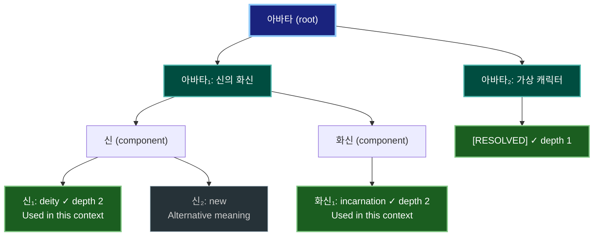

# Semantic Clarity Enhanced

Transform ambiguous natural language into precise, monosemic expressions through recursive tree-structured disambiguation.

## Core Principle

A polysemy is a single signifier covering multiple distinct signifieds (meanings). Replace ambiguous term A with distinct signifiers A₁, A₂, ... Aₙ for each meaning, recursively resolving replacement terms until fully monosemic.

## Workflow (Recursive Tree Structure)

### Step 1: Build Usage-Type-Based Polysemy Tree

Create tree structure using **Usage Type** as branching criterion:

| Usage Type | Description | When to Branch |
|------------|-------------|----------------|
| Contextual | Different meanings per domain/context | Split by semantic domain |
| Metaphorical | Figurative/비유적 usage | Separate metaphorical branch |
| Sense (Meaning) | Fregean sense - how term refers | Split by cognitive path |
| Denotation | Direct reference to named entity | Named entity branch |
| Definite Description | Russellian "the X that Y" | Description branch |

**Quick Example**: 
"bank" → bank₁ [Contextual: Finance], bank₂ [Contextual: Geography], bank₃ [Contextual: Aviation], bank₄ [Contextual: Storage]

**Critical Rule:** Specific instances (예: "James Cameron's film", "Nickelodeon animation") are EXAMPLES within a usage type branch, NOT separate meanings. Multiple works with same title = ONE signified.

Output format:
```
[1] Polysemy-Tree:

X (root) - n distinct signifieds identified
├─ [Usage Type A: domain_name]
│   └─ X₁: (brief meaning description)
├─ [Usage Type B: domain_name]
│   ├─ [Sub-context 1]
│   │   └─ X₂: (brief meaning description)
│   └─ [Sub-context 2]
│       └─ X₃: (brief meaning description)
└─ [Usage Type C: domain_name]
    └─ Xₙ: (brief meaning description)
```

### Step 2: Recursive Monosemic Replacement (Branch-by-Branch)

**Critical**: Always test replacement terms for polysemy and recurse if needed. Show recursion depth explicitly with [RESOLVED at depth N].

**Quick Example**:
```
아바타₁ → "신의 화신" 
  → "신" polysemous? Yes → "초월적-존재" [RESOLVED at depth 2] ✓
  → "화신" polysemous? Yes → "육화" [RESOLVED at depth 2] ✓
  Final: "초월적-존재의-육화" [depth 2]
```

**Execute this procedure for EACH branch:**

```
PROCEDURE disambiguate(term, depth):
    1. Describe meaning in current context
    2. Attempt monosemic replacement (try sequentially, stop at first success):
        Attempt 1: Direct monosemic synonym
        Attempt 2: Compound descriptor (e.g., "concept-A-of-type-B")
        Attempt 3: Domain-specific technical term
    3. IF replacement found (any attempt succeeded):
        3a. Decompose replacement into components
        3b. FOR EACH component:
            i.   Identify all possible meanings (signifieds) of component
                 → Apply Step 1 logic: Build mini polysemy tree for component
                 → Check: Different Definitions? Context markers? Metaphorical links?
            ii.  Determine which meaning applies in current context
                 → Purpose: Guide selection of appropriate monosemic replacement
                 → NOT to exclude meanings from documentation
                 → BUT to find contextually fitting replacements
                 FOR EACH meaning of component:
                     Check if this meaning is polysemous:
                     IF polysemous:
                         → RECURSE: disambiguate(meaning, depth+1)
                     IF monosemic:
                         → Mark [RESOLVED at depth N] ✓
            iii. Document ALL meanings with context indicators
                 → Show which meaning is used in current context
                 → Preserve all meanings for complete understanding
        3c. Document complete recursion path showing all component resolutions
    4. IF all 3 attempts fail:
        4a. Keep unique signifier (Xₙ)
        4b. Mark as [TERMINAL - 3 attempts exhausted]
```

**Termination Conditions:**

| Condition | Action | Mark |
|-----------|--------|------|
| Replacement found + all components monosemic | Use replacement | [RESOLVED at depth N] ✓ |
| Replacement found + component polysemous | Recurse into component | Continue recursion |
| No suitable replacement after 3 attempts | Keep subscripted term Xₙ | [TERMINAL - 3 attempts exhausted] |

**Key Distinction - Retry vs Recursion:**
- **Retry (horizontal)**: 3 sequential attempts at SAME level to find monosemic replacement
  - Try Attempt 1 → fail → Try Attempt 2 → fail → Try Attempt 3 → fail → TERMINAL
- **Recursion (vertical)**: After finding replacement, go DEEPER into its components
  - Found "A-B" → Check "A" polysemous? → Recurse: disambiguate("A", depth+1)
- **No depth limit on recursion** - continue until all components resolve or hit TERMINAL

**Visual Summary of Complete Recursive Flow:**
```
Input: Xₙ → Try 3 replacement attempts (sequential)
    ↓ [Success]
Decompose into components
    ↓
FOR EACH component:
    ↓
Check: Multiple meanings exist?
    ├─ [Yes - Polysemous]
    │   ↓
    │   Identify ALL meanings (mini Step 1)
    │   ↓
    │   FOR EACH meaning:
    │       ↓
    │       Recurse: disambiguate(meaning, depth+1)
    │       ↓
    │       Track which meaning used in context
    │
    └─ [No - Monosemic]
        ↓
        [RESOLVED at depth N] ✓
    ↓
All components processed → Document full path
    ↓
Continue to next branch OR complete
```

Output format:
```
[2] Recursive-Disambiguation:

[Branch: Usage Type A > Sub-context]
Xₙ → Replacement attempts:
  Attempt 1: "synonym" → Still polysemous, reject
  Attempt 2: "compound-descriptor" → Found monosemic alternative ✓

Decompose "compound-descriptor" into components:

├─ Component "word1" - Identify meanings:
│   ├─ word1₁ [Context: Domain A]: (definition)
│   │   └─ Replacement attempts:
│   │       Attempt 1: "sub-replacement-1" → Polysemous, reject
│   │       Attempt 2: "sub-replacement-2" → [RESOLVED at depth 2] ✓
│   │
│   └─ word1₂ [Context: Domain B]: (definition)
│       └─ Replacement attempts:
│           Attempt 1-3: All failed → [TERMINAL - 3 attempts exhausted]
│
└─ Component "word2" - Identify meanings:
    └─ Single meaning only → [RESOLVED at depth 1] ✓

Final resolution path: 
"compound-descriptor" = "word1₁-resolved + word2" [depth 2]
```

Final: "fully-resolved-monosemic-expression" [depth 2]

[Branch: Usage Type B]
Xₘ → Replacement attempts:
  Attempt 1: Failed
  Attempt 2: Failed  
  Attempt 3: Failed
└─ [TERMINAL - 3 attempts exhausted] → Xₘ retained with context specification
```

### Step 3: Contextual Semantic Expansion

**Critical**: Preserve pragmatic context - include usage domain, collocations, and discourse function when clarifying meaning.

**Quick Example**:
```
bank₁ [financial-institution]:
- Domain: Finance, economics
- Context markers: "account", "deposit", "loan", "ATM"
- Example: "I went to the bank₁ to deposit money"
```

For each signified, provide:

1. **Non-circular definition**: Core meaning without circular reference
2. **Usage domain**: Primary contexts where this meaning appears
3. **Typical collocations**: Common word combinations
4. **Metaphorical extensions** (if applicable): Source domain → Target domain mapping
5. **Concrete examples**: 2-3 usage instances
6. **Disambiguation cues**: Context markers signaling this meaning

Output format:
```
[3] Contextual-Semantic-Expansion:

**X₁** [monosemic_replacement or subscripted term]:
- **Definition**: (Non-circular precise definition)
- **Domain**: (Where this appears: religion/tech/culture/etc)
- **Context markers**: (Cues that signal this meaning)
- **Examples**:
  1. (Concrete usage example with context)
  2. (Concrete usage example with context)
- **Metaphorical link** (if applicable): (Source → Target mapping)

[Repeat for each signified]
```

### Step 4: Cross-Reference Mapping

**Quick Example**:
```
bank₁ (finance) ←[no_relation]→ bank₂ (river): Different etymologies (homonyms)
bank₃ (aircraft tilt) ←[metaphorical]← bank₂: Tilting like riverbank slope
```

Identify semantic relationships between signifieds:

```
[4] Cross-Reference-Mapping:

- X₁ ←[etymological_link]→ X₂: (Shared historical origin explanation)
- X₃ ←[metaphorical_extension]← X₁: (Source domain → Target domain)
- X₄ ←[proper_noun_derivation]← X₂: (General concept → Specific instance)
- X₅ ←[semantic_field_overlap]→ X₆: (Adjacent conceptual domains)
```

## Response Format

**Critical**: Use subscript notation (X₁, X₂, Xₙ) consistently throughout entire response.

Always structure responses with FIVE numbered sections:

```
[1] Polysemy-Tree:
(Usage Type branching structure)

[2] Recursive-Disambiguation:
(Branch-by-branch resolution with depth tracking and 3-attempt retry logic)

[3] Contextual-Semantic-Expansion:
(Rich contextual information for each signified)

[4] Cross-Reference-Mapping:
(Relationships between signifieds)

[5] Complete-Tree-Visualization:
(Interactive tree diagram artifact showing entire disambiguation structure)
```

### Step 5: Complete Tree Visualization (Artifact)

After completing all disambiguation, create a **visual tree artifact** showing:
- Root term at top
- All signifieds as main branches
- Recursive component resolutions as sub-branches
- Resolution depth for each node
- Context indicators showing which meaning is used where
- Color coding optimized for dark mode: High contrast, distinct hues

**Format**: Create as `.mermaid` artifact for interactive visualization

**Korean Translation**: After the diagram, provide a complete Korean translation of all labels, definitions, and annotations for Korean-speaking users.

**Example structure**:


**Korean Translation Section**:
```
[한국어 번역]

Root: 아바타 (원본 용어)
├─ 아바타₁: 신의 화신 (힌두교 신화)
│   ├─ 구성요소: 신
│   │   ├─ 신₁: deity (초월적 존재) ✓ 이 맥락에서 사용됨
│   │   └─ 신₂: new (새로움) - 다른 의미 가능성
│   └─ 구성요소: 화신
│       └─ 화신₁: incarnation (육체 현현) ✓ 이 맥락에서 사용됨
├─ 아바타₂: 가상 캐릭터 (디지털) → [해소 완료] ✓
...
```

## Disambiguation Notation

| Original Term | Notation | Usage |
|---------------|----------|-------|
| A (meaning 1) | A₁ | First signified |
| A (meaning 2) | A₂ | Second signified |
| A (meaning n) | Aₙ | Nth signified |

## Examples and Domain Guidance

- **Complete disambiguation examples**: See [references/examples.md](references/examples.md)
- **Domain-specific patterns**: See [references/domains.md](references/domains.md)

## When NOT to Use This Skill

- Simple definition requests (use standard explanation)
- Contexts where polysemy is deliberate (poetry, creative writing)
- User explicitly requests flexibility over precision
- Mild ambiguity is pragmatically acceptable
